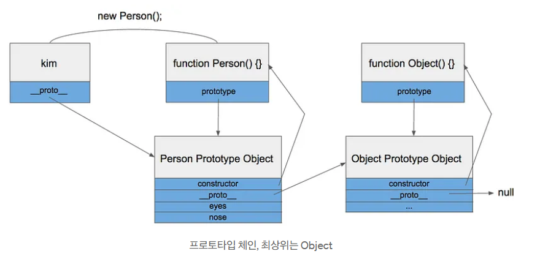

### 프로디지털 아카데미 자바스크립트 강의 (5/3)

### Promise.all
- 비동기 작업 여러개를 한꺼번에 처리할 경우에!
- Promise.all 메서드는 Promise 객체의 배열을 인자로 받음.
- 모든 Promise가 성공적으로 이행(resolved) 될 때까지 기다림.
- 모든 Promise가 이행되면, 각 Promise의 결과값을 담은 배열이 이행 값으로 반환.
- 만약 하나라도 거부 (rejected)되면, Promise.all은 즉시 그 이유로 reject
```jsx
function runTasks() {
    Promise.all([fastFunction(10), slowFunction(5)])
    .then(([result1, result2]) => {
        console.log("작업완료", result1, result2);
    });
}
```

### Promise.race
- Promise 가 하나라도 이행되거나 거부되면, 그걸로 끝낼래 (경쟁시킬래)
- Promise.race 메서드는 Promise.all과 유사하게 Promise 객체의 배열을 인자로 받지만,
- 배열 내의 Promise 중 하나라도 이행하거나 거부되는 즉시,
- 그 Promise의 결과 (이행 값 또는 거부 사유)와 함께 실행을 완료
- 즉, "경주"에서 이기는 첫번째 Promise의 결과만 가져옴
```jsx
function runTask() {
    Promise.race([fastFunction(5), slowFunction(10)])
    .then(data => {
        console.log("작업 완료");
        console.log(data);
    })
}
```

### Promise. allSettled
- 비동기 함수를 병렬적으로 실행하고 모아서 작업할래
- (모든 Promise가 resolve 혹은 reject를 기다림)
- Promise.allSettled 메서드는 모든 프로미스가 완료를 기다림.(성공이든 실패든)
- 그리고 각 프로미스의 결과에 대한 정보를 담은 객체 배열을 반환합니다.
- 각 객체는 { status, value } 또는 { status, reason }의 형태를 가지며, status는 "fulfilled" 또는 "rejected"
- fulfilled된 프로미스는 value 속성을, rejected된 프로미스는 reason 속성을 가집니다.
```jsx
function runTask() {
    Promise.allSettled([fastFunction(5), slowFunction(10), Promise.reject(new Error("Errors"))])
        .then(data => {
            console.log("작업 완료");
            console.log(data);
        })
}
```

### Promise.any
- 하나가 성공할 때까지 기다릴래
- Promise.any 메서드는 주어진 프로미스 중 하나라도 resolved되면 즉시 그 프로미스의 결과값으로 fullfiled하는 새로운 프로미스를 반환합니다. 
- 모든 프로미스가 거부(rejected)될 경우, AggregateError 타입의 에러와 함께 rejected됩니다.
```jsx
function runTask() {
    Promise.any([
        fastFunction(5),
        slowFunction(10),
        Promise.reject(new Error("Error")),
    ])
    .then((data)=>{
        console.log("작업완료");
        console.log(data);
    })
}
```

### OOP
- 자바스크립트는 `class` 가 없다!
- constructor는 생성자 함수 그 자체
- prototype은 생성자 함수에 정의한 모든 객체가 공유할 원형
- __proto__는 생성자 함수를 new로 호출할 때, 정의해두었던 prototype을 참조한 객체
- prototype은 생성자 함수에 사용자가 직접 넣는 거고, `__proto__`는 new를 호출할 때 prototype을 참조하여 자동으로 만들어짐
- Animal.prototype === animal2.__proto__
- 객체의 속성을 호출하였는데 없으면 proto 참조하여 호출

```jsx
function Animal(name) {
    this.name = name;
    this.run = function(){
        console.log(`${this.name} 동물이 달린다.`)
    }
}

const animal = new Animal("사자");
console.log(animal);
console.log(animal.constructor);
animal.run();
```

### 프로토타입
- <a href="https://poiemaweb.com/js-prototype">프로토타입 관련 정리된 글</a>


### 브라우저를 위한 Javascript
- **DOM (Document Object Model)**: HTML 및 XML 문서의 구조적 표현을 메모리에
로드하는 방식입니다. 웹 페이지의 각 요소에 접근하고 수정할 수 있는 API를 제공하여, 문서 구조, 스타일, 내용 등을 동적으로 조작할 수 있다.
- **getElementById**: ID를 통해 특정 요소를 선택한다.
- **getElementsByClassName**: 특정 클래스를 가진 모든 요소를 선택한다.
- **querySelectorAll**: css selector로 모두 조회
- **querySelector**: css selector로 조회 (하나만)
- **getAttributes**: HTML 요소의 속성을 가져올 수 있다. 이 메서드는 특정 요소의 속성 값을 가져오기 위해 사용된다.
- **document.createElement(a)**
- **header.appendChild(child)** 

### Event
- 이벤트는 웹 페이지 상에서 사용자의 동작이나 브라우저의 특정 활동에 반응하여 발생하는 신호 또는 알림
- 자바스크립트와 HTML에서 이벤트는 웹 애플리케이션과 상호작용하는 주요 방법 중 하나.
- 이벤트를 이해하고 적절히 사용하는 것은 동적인 웹 페이지를 구성하는 데 필수.

**이벤트의 종류**
- UI 이벤트: 사용자 인터페이스에 발생하는 일반적인 이벤트입니다. 예를 들어, 페이지 로딩(load), 언로딩(unload), 뷰포트 크기 조정(resize), 스크롤(scroll) 등이 있음.
- 키보드 이벤트: 사용자가 키보드를 사용할 때 발생합니다. 주요 이벤트로는 keydown, keyup, keypress가 있습니다.
- 마우스 이벤트: 마우스를 사용할 때 발생하는 이벤트입니다. click, dblclick, mouseup, mousedown, mousemove, mouseover, mouseout 등이 포함됩니다.
- 포커스 이벤트: 요소가 포커스를 얻거나 잃을 때 발생합니다. focus, blur, focusin, focusout 등이 있습니다.
- 폼 이벤트: 웹 폼과 관련된 이벤트입니다. submit, change, input, reset 등이 포함됩니다.
- 터치 이벤트: 모바일 장치에서 터치 스크린을 통한 상호작용 시 발생합니다. touchstart, touchmove, touchend, touchcancel 등이 있습니다.

**이벤트 리스너와 이벤트 객체**
- 이벤트 리스너는 특정 이벤트가 발생했을 때 호출되는 함수
- element.addEventListener 이벤트 객체는 이벤트 type, target 요소, 이벤트와 관련된 데이터 포함.